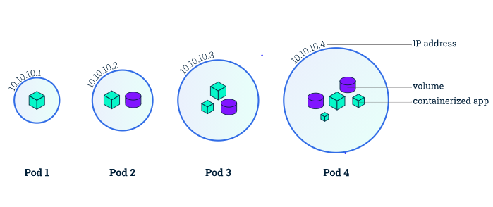

# POD
- Trong kubernetes thì pod là đơn vị nhỏ nhất. Pod được cấu thành từ 1 container hoặc nhiều container, chúng chia sẻ địa chỉ IP giữa các container với nhau. Nói cách khác nếu chúng ta tạo một Pod chứa 2 container trở lên thì các container này sẽ đồng nhất với nhau địa chỉ IP. Vì vậy các container trong cac pod sẽ trao đổi với nhau như trong môi trường local. Ngoài ra các container trong cùng 1 pod cũng chia sẻ với nhau vùng chứa gọi là volume


**Create pod
- Ta tạo 1 file ```pod_sample.yml``` đơn giản như sau, pod này chứa 1 container là nginx:1.12, mở port 80 cho container này
```
apiVersion: v1
kind: Pod
metadata:
  name: sample-pod
spec:
  containers:
    - name: nginx-container
      image: nginx:1.12
      ports:
      - containerPort: 80
```
- Chạy lệnh để create pod: 
```
$ kubectl apply -f pod_sample.yml 
pod "sample-pod" created
```
- Kiểm tra Pod đã được khởi tạo ok chưa.
```
$ kubectl get pods
NAME         READY     STATUS    RESTARTS   AGE
sample-pod   1/1       Running   0          1m
```
- Như ở trên thì mình có thể thấy là Pod đã run ok rồi, các bạn muốn lấy thông tin chi tiết hơn chút thì ta dùng lệnh option -o wide
```
$ kubectl get pods -o wide
NAME         READY     STATUS    RESTARTS   AGE       IP           NODE
sample-pod   1/1       Running   0          3m        172.17.0.4   minikub
```
**Create Pod chứa 2 container
- Tạo file ```.pod_sample.yml```
```
apiVersion: v1
kind: Pod
metadata:
  name: sample-2pod
spec:
  containers:
    - name: nginx-container-112
      image: nginx:1.12
      ports:
      - containerPort: 80
    - name: nginx-container-113
      image: nginx:1.13
      ports:
      - containerPort: 81
```
- Chạy lệnh để tạo pod:
```
# Create pod
$ kubectl apply -f 2pod_sample.yml 
pod "sample-2pod" created

# Get list pods
$ kubectl get pods
NAME          READY     STATUS    RESTARTS   AGE
sample-2pod   2/2       Running   0          3s
```

#Tham khảo
- https://blog.vietnamlab.vn/nhap-mon-kubernetes-p4-kubernetes-workloads-resource-1/