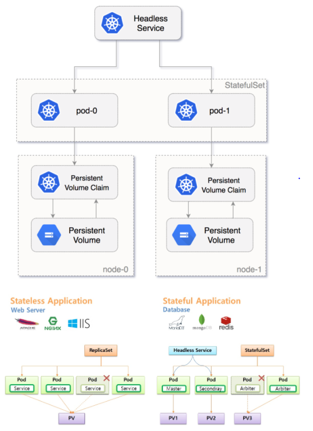

# Stateful và stateless applications
- Để hiểu rõ ta cần bắt đầu lại tự khái niệm:
  - Ứng dụng dạng stateless:
    - Các ứng dụng stateless thường là các service dụng nginx, apache hoặc chạy dạng HTTP Request. Gọi là stateless app vì mỗi request tới nginx hoặc apache chúng sẽ độc lập với nhau.
    - VD: Gửi HTTP tới Backend API, mỗi API sẽ độc lập không ảnh hưởng tới các API khác.
  - Ứng dụng dạng stateful:
    - Các ứng dụng stateful thường là các service dạng database, điển hình nhất là mariadb, mysql.
    - VD: Các database như mariadb hoặc mysql sẽ gặp phải vấn đề chỉ có thể ghi trên 1 node và ghi trên nhiều node.
    - Và các database dạng mysql, mariadb không thể scale hàng loạt bởi lý do cơ chế master slave, cơ chế ghi 1 đọc nhiều node 

- Qua đó, Deployment phù hợp hơn cho các ứng dụng dạng stateless, khi mà pod có thể sinh ra và mất đi linh hoạt

```Statefulset``` sinh ra khi phải quản lý pod chặt chẽ, ví dụ triển khai cụm mariadb master slave 3 node trên k8s.


# Khái niệm headless Service
- Thông thường khi tạo deployment, expose service ra bên ngoài chúng ta sẽ khởi tạo một Service để load-balance traffic xuống các Pod.
- Vậy, đặt câu hỏi "Có cách để chúng ta có thể truy cập trực tiếp các Pod IP thông qua DNS endpoint nội bộ?"
- Để giải quyết bài toán này, k8s sinh ra khái niệm "Headless Service". Với Headless Service, chúng ta có thể kết nối trực tiếp với Pods.
- Ta chỉ cần cấu hình phần ```“.spec.clusterIP”``` là ```“None”``` là ta đã quy định Service là loại Headless. Khi đó Cluster IP sẽ không được cấp phát cho Service mà ta khai báo, kube-proxy sẽ không xử lý đối tượng Service. Lúc này DNS của Service sẽ trả về thông tin là các địa chỉ IP của Pod khớp với Selector.


*Ví dụ*, điển hình nhất cần sử dụng Headless Service là bài toán triển khai database trong k8s.

- VD: Cấu hình Headless Service trong Kubernetes
  - Chúng ta sẽ cùng lab để hiểu hơn về loại Service Headless :
  - Tạo một Deployment Nginx với 4 pod.
  - Tạo một ClusterIP Service để có thể truy cập cân bằng tải 4 pod Nginx thông qua DNS ClusterIP Service với 1 IP cụ thể.
  - Tạo một Headless Service để có thể truy cập cân bằng tải 4 Pod Nginx thông qua DNS Headless Service đến trực tiếp các IP Private của Pod.
  - Chúng ta tạo ra một Deployment Nginx với Replica là 4, tương đương 4 Pods

```
# vi deployment-nginx.yaml

apiVersion: apps/v1
kind: Deployment
metadata:
  name: nginx
  labels:
    app: nginx
spec:
  replicas: 4
  selector:
    matchLabels:
      app: nginx
  template:
    metadata:
      labels:
        app: nginx
    spec:
      containers:
      - name: nginx
        image: nginx:latest
        imagePullPolicy: Always
        ports:
        - containerPort: 80

# kubectl apply -f deployment-nginx.yaml
deployment.apps/nginx created
```
Kiểm tra các Pod Nginx đang chạy nào

```
# kubectl get pods -l app=nginx -o wide
NAME READY STATUS RESTARTS AGE IP NODE NOMINATED NODE READINESS GATES
nginx-59c9f8dff-8rgbs 1/1 Running 0 39s 10.1.0.7 docker-desktop <none> <none>
nginx-59c9f8dff-9r42j 1/1 Running 0 39s 10.1.0.8 docker-desktop <none> <none>
nginx-59c9f8dff-fktcq 1/1 Running 0 39s 10.1.0.10 docker-desktop <none> <none>
nginx-59c9f8dff-s4vnw 1/1 Running 0 39s 10.1.0.9 docker-desktop <none> <none>
```
Kiểm tra các Pod IP.

```# kubectl get pods -l app=nginx -o yaml | grep podIP:
podIP: 10.1.0.7
podIP: 10.1.0.8
podIP: 10.1.0.10
podIP: 10.1.0.9
```
- Giờ ta sẽ tạo một Service với loại mặc định là ClusterIP, khai báo listen ở port 80 (nginx) TCP.
```
# vi svc-clusterip-nginx.yaml
apiVersion: v1
kind: Service
metadata:
  name: svc-clusterip-nginx
  labels:
    app: nginx
spec:
  ports:
  - port: 80
    protocol: TCP
  selector:
    app: nginx

# kubectl apply -f svc-clusterip-nginx.yaml
service/svc-clusterip-nginx created
```
Kiểm tra thông tin Service Cluster IP nginx.

```# kubectl get svc svc-clusterip-nginx
NAME TYPE CLUSTER-IP EXTERNAL-IP PORT(S) AGE
svc-clusterip-nginx ClusterIP 10.106.79.1 <none> 80/TCP 14s
```
- Chúng ta tạo tiếp một Service với loại là Headless Service, khai báo listen ở port 80 (nginx) TCP.

```# vi svc-headless-nginx.yaml
apiVersion: v1
kind: Service
metadata:
  name: svc-headless-nginx
  labels:
    app: nginx
spec:
  clusterIP: None # <-- Don't forget!!
  ports:
  - port: 80
    protocol: TCP
  selector:
    app: nginx

# kubectl apply -f svc-headless-nginx.yaml
service/svc-headless-nginx created
```
- Kiểm tra thông tin Service Headless nginx.

```# kubectl get svc svc-headless-nginx
NAME TYPE CLUSTER-IP EXTERNAL-IP PORT(S) AGE
svc-headless-nginx ClusterIP None <none> 80/TCP 46s
```
# Tham khảo
- https://cuongquach.com/headless-service-trong-kubernetes-la-gi.html
- https://www.baeldung.com/ops/kubernetes-deployment-vs-statefulsets?fbclid=IwAR3JHDTi6pCTaUEZEHKXEHse8_BP-0fRkJRyLKaIR2iGeSyHQl_qwcmoxUU
- https://github.com/lacoski/kubernetes-note/blob/main/docs/2.6-sfs-k8s.md