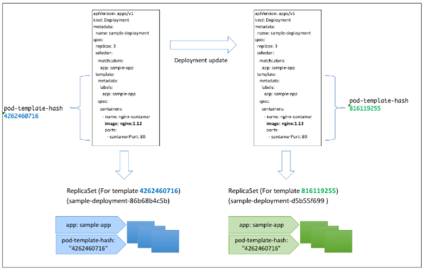

# Deployment
- Deployment là loại resource có khả năng thực hiện việc Roling update, Roll back vv bằng việc quản lý nhiều ReplicaSet.
- Cơ chế đơn giản như sau:
  - Tạo một ReplicaSet mới
  - Dần dần tăng số lượng replica (số Pod) trên ReplicaSet mới
  - Dần dần giảm số lượng replica (số Pod) trên ReplicaSet cũ
  - Lặp lại bước 2,3
  - ReplicaSet cũ sẽ lưu lại với replica: 0


- Lúc thực hiện chuyển đổi qua ReplicaSet mới.
  - Vừa có thể kiểm tra việc khởi động container hay tình trạng Helth check trên ReplicaSet mới.
  - Vừa có thể chỉ định chi tiết số lượng Pod lúc di chuyển ReplicaSet
- Kubernetes là công cụ được đề cử nhiều nhất về phương pháp khởi động container. Cho dù hệ thống có 1 container đi nữa, thì việc khởi động container sử dụng Deployment cũng rất được kỳ vọng

## Create Deployment

- Việc đầu tiên thì chúng ta cũng chuẩn bị fiel YAML config deployment_sample.yml. Nó trông cũng không khác file config của ReplicaSet mấy.
```
apiVersion: apps/v1
kind: Deployment
metadata:
  name: sample-deployment
spec:
  replicas: 3
  selector:
    matchLabels:
      app: sample-app
  template:
    metadata:
      labels:
        app: sample-app
    spec:
      containers:
        - name: nginx-container
          image: nginx:1.12
          ports:
            - containerPort: 80
```
- Lần này khi create resource, chúng ta thêm option --record để lưu lại lịch sử lúc update.
```
$ kubectl apply -f deployment_sample.yml --record
deployment.apps/sample-deployment created
```
- Lịch sử sẽ lưu lại trong metadata.annotations.kubernetes.io/change-cause của ReplicaSets, chúng ta có thể confirm như bên dưới. Thông số metadata.annotations.deployment.kubernetes.io/revision cũng cho ta biết số lần sửa đổi.
```
$ kubectl get rs -o yaml | head
apiVersion: v1
items:
- apiVersion: extensions/v1beta1
  kind: ReplicaSet
  metadata:
    annotations:
      deployment.kubernetes.io/desired-replicas: "3"
      deployment.kubernetes.io/max-replicas: "4"
      deployment.kubernetes.io/revision: "1"
      kubernetes.io/change-cause: kubectl apply --filename=deployment_sample.yml --record=true
```
- Command "Kubectl run" cũng có khả năng tạo ra một Deployment, chỉ có điểm khác nhau là nó gán lable mặc định là run: sample-deployment, nhưng vì khả năng xảy ra xung đột của nó thấp nên thỉnh thoảng chúng ta cần test một images nào đó thì cũng có thể sử dụng rất tiện lợi.
```
$ kubectl run sample-deployment --image nginx:1.12 --replicas 3 --port 80
deployment.apps/sample-deployment created
```
- Chúng ta có thể kiểm tra lại thông tin Deployment, ReplicaSet, Pods 
```
$ kubectl get deployment
NAME                DESIRED   CURRENT   UP-TO-DATE   AVAILABLE   AGE
sample-deployment   3         3         3            3           2m

$ kubectl get rs
NAME                          DESIRED   CURRENT   READY     AGE
sample-deployment-5f7c4b7b4   3         3         3         2m

$ kubectl get pods
NAME                                READY     STATUS    RESTARTS   AGE
sample-deployment-5f7c4b7b4-59rlm   1/1       Running   0          2m
sample-deployment-5f7c4b7b4-69bjd   1/1       Running   0          2m
sample-deployment-5f7c4b7b4-vzpqq   1/1       Running   0          2m
```
- Bây giờ mình muốn thay đổi version nginx từ nginx:1.12 -> nginx:1.13 trong deployment vừa rồi. Chúng ta có command 「kubectl set image」.
```
$ kubectl set image deployment sample-deployment nginx-container=nginx:1.13
deployment.extensions/sample-deployment image updated
```
- Sau khi update xong thì ReplicaSet đã được tạo mới, giống như hình phía trên mình đã trình bày về rolling update, thì bây giờ Pod đã được tạo lại, về cơ bản thì không ảnh hưởng gì đến service của chúng ta.
```
kubectl get deployment
NAME                DESIRED   CURRENT   UP-TO-DATE   AVAILABLE   AGE
sample-deployment   3         3         3            3           23m

$ kubectl get rs
NAME                           DESIRED   CURRENT   READY     AGE
sample-deployment-86b68b4c5b   0         0         0         23m
sample-deployment-d5b55f699    3         3         3         16m

$ kubectl get pods
NAME                                READY     STATUS    RESTARTS   AGE
sample-deployment-d5b55f699-4zqw2   1/1       Running   0          15m
sample-deployment-d5b55f699-9xvrj   1/1       Running   0          16m
sample-deployment-d5b55f699-zgv5w   1/1       Running   0          16m
```

## Điều kiện update Deployment (ReplcaSet được tạo ra)
- Khi update Deployment thì ReplicaSet mới sẽ được tạo ra. Việc "Update" ở đây không bao gồm việc thay đổi số lương replica mà chính là việc thay đổi nội dung của Pod được tạo ra. Nói một cách chính xác hơn thì khi spec.template thay đổi thì sẽ tạo ra ReplicaSet mới, và thực hiện Rolling update.
- Thực tế khi xem định nghĩa ReplicaSet, tại phần dưới spec.template tính toán giá trị hash và quản lý nó bằng label đã được gắn. Thêm nữa khi thực hiện cơ chế này, trong trường hợp chúng ta muốn quay về lại image cũ, bằng cách thủ công nếu chúng ta setting cùng giá trị hash, thì sẽ không sinh ra ReplicaSet mới, mà sử dụng lại ReplicaSet đã tồn tại trước đó.
```
$ kubectl get rs sample-deployment-d5b55f699 -o yaml
...
...
spec:
  replicas: 3
  selector:
    matchLabels:
      app: sample-app
      pod-template-hash: "816119255"
...
...
```
- Trong ví dụ lần này vì chúng ta thay đổi image của Pod từ nginx:1.12 sang nginx 1.13 nên Pod Template Hash được tính toán lại và ReplicaSet được tạo mới.


## Rollback Update
- Deployment có chức năng roolback. Thực chất của chức năng roolback đó chính là việc chuyển đổi ReplicaSet hiện tại đang sử dụng. ReplicaSet về cơ bản sau khi được chuển đổi vẫn tồn tại ở trạng thái replica: 0 như lưu history vậy. Vì vậy nó có thể tăng số lượng replica bằng việc tái sử dụng lại:
```
kubectl get rs
NAME                           DESIRED   CURRENT   READY     AGE
sample-deployment-86b68b4c5b   0         0         0         21h
sample-deployment-d5b55f699    3         3         3         21h
```
- Để kiểm tra lịch sử update chúng ta sử dụng command 「kubectl rollout history」. Tại mục CHANGE-CAUSE, vì chung ta đã truyền option --record lúc create Deployment nên nó đã lưu lại, trường hợp không có option --record thì nó sẽ không hiển thị.
```
$ kubectl rollout history deployment sample-deployment
deployments "sample-deployment"
REVISION  CHANGE-CAUSE
1         kubectl create --filename=deployment_sample.yml --record=true
2         kubectl set image deployment sample-deployment nginx-container=nginx:1.13
```
- Khi thực hiện rollback, dĩ nhiên chúng ta có thể chỉ định việc muốn rollback đến revision nào bằng cách gán thêm parameter
```
# Trường hợp rollback về revision ngay trước đó
$ kubectl rollout undo deployment sample-deployment 
deployment "sample-deployment" rolled back

# Trường hợp chỉ định revision cụ thể
$ kubectl rollout undo deployment sample-deployment --to-revision 1
deployment "sample-deployment" rolled back
```
- Sau khi thực hiện rollback thì Pod đã được khởi động trên ReplicaSet cũ.
*Xem qua thì các bạn thấy cách rollback kiểu này có vẻ rất hay, tuy nhiên thực tế thì rất ít người dùng, lý do thay vì thực hiện rollback bằng command kubectl rollout thì chúng ta chỉnh sửa trực tiếp lên file YAML và chạy lệnh kubectl apply thì tốt hơn. Khi thay đổi spec.template về lại trạng thái trước khi update (nginx 1.12) thì Pod Template Hash cũng về lại giá trị ban đầu. Vì vậy Pod được khởi động trên ReplicaSet phù hợp, giống như lệnh kubectl rollout.*

## Deployment scaling
- Cũng giống như ReplicaSets chúng ta có thể sử dụng 「kubectl scale」 hoặc 「kubectl apply -f」 để scaling.

# Tham khảo
- https://blog.vietnamlab.vn/nhap-mon-kubernetes-p4-kubernetes-workloads-resource-1/