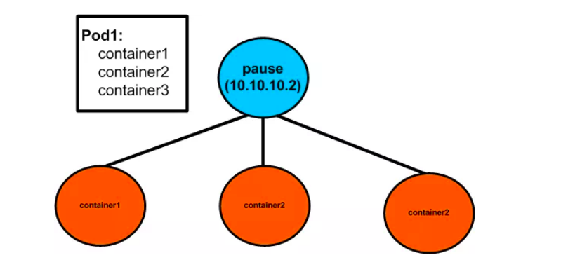

# What is pause container in Kubernetes?
- Khi bạn run command ```docker ps``` trên các node trong 1 cluster, bạn có để ý  thấy 1 số container ```pause``` đang chạy không??


- Chúng được gọi là các ```sandbox containers```, có nhiệm vụ lưu giữ ```network namespace``` được chia sẻ bởi tất cả container trong 1 pod. Với cơ chế này, trong 1 POD khi 1 container chết hoặc 1 container mới được tạo ra thì IP POD sẽ không thay đổi


# Tham khảo:
- https://www.linkedin.com/pulse/4-most-important-kubernetes-interview-questions-raju-kumar- 