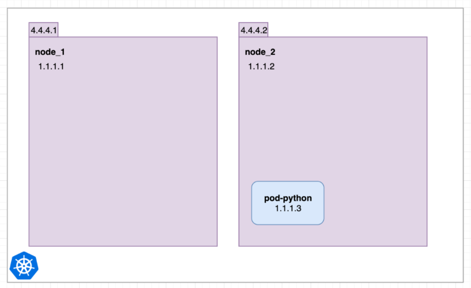
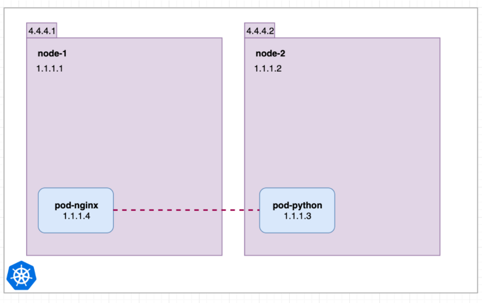
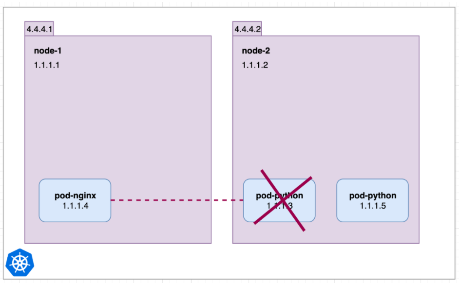
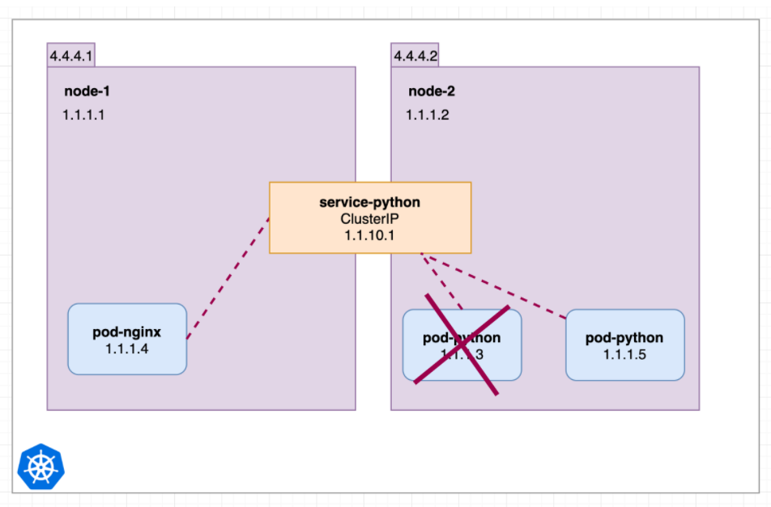
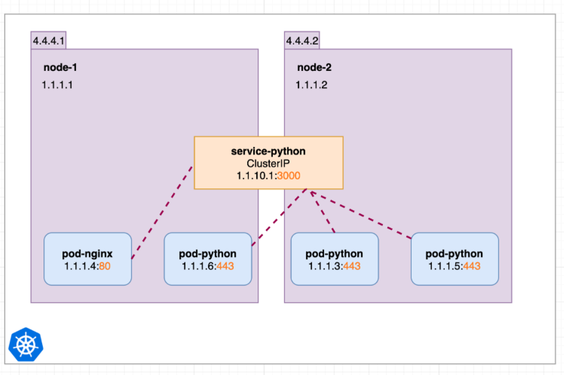
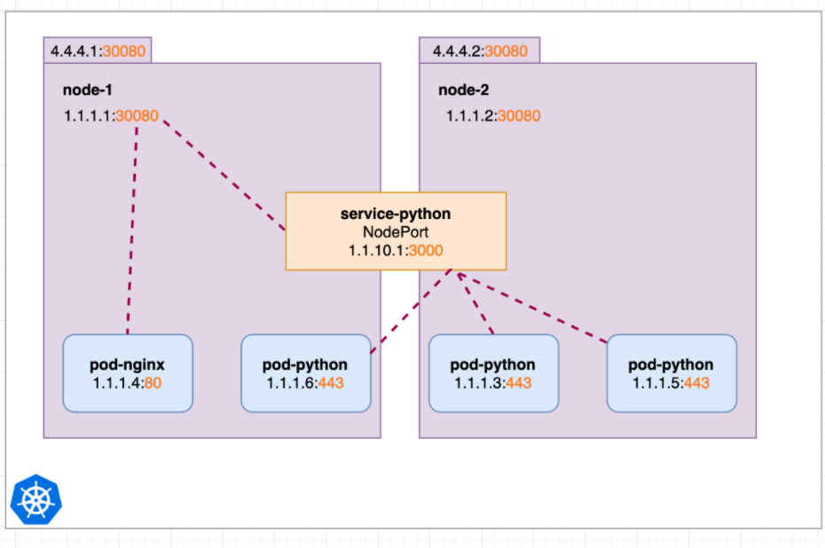
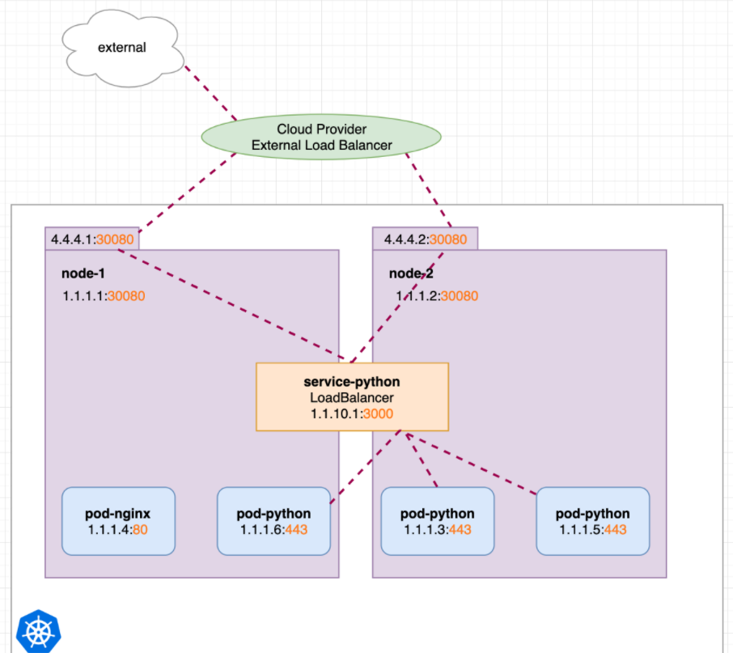
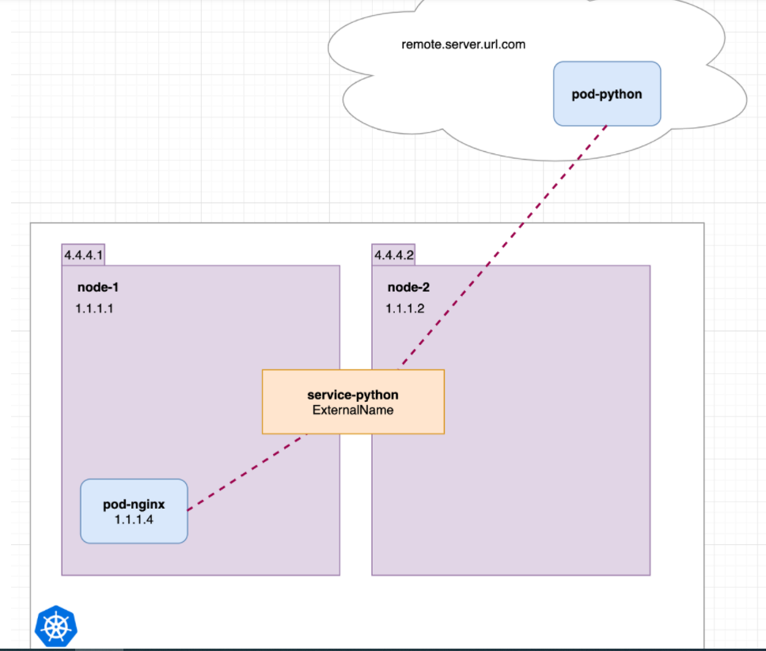
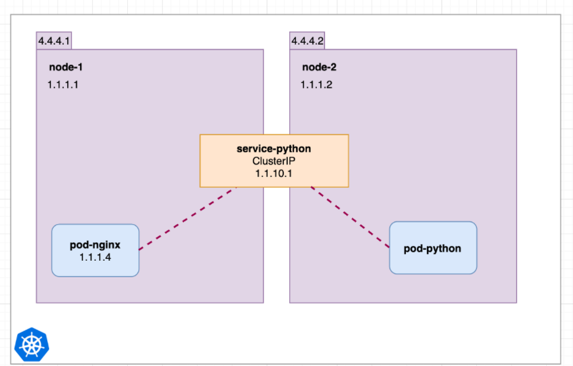

Service

- Các pod được quản lý trong kubernetes , trong vòng đời của nó chỉ diễn ra như sau: create -> run -> delete -> create. Các pod không thể tạm dừng hay chạy lại pod đang dừng
- Mặc dù với mỗi pod khi tạo ra sẽ có một IP để liên lạc tuy nhiên vấn đề xảy ra mỗi khi pod thay thế thì nó sẽ có IP khác, các dịch vụ truy cập pod cố định sẽ không biết IP mới đó.
 ---> Để giải quyết vấn đề này ta sẽ cần đến service
 
- Service là một đối tượng xác định ra một nhóm pod và chính sách để truy cập pod đó. Nhóm các pod mà Service xác định thường dùng kỹ thuật Selector (chọn các pod thuộc về một Service theo label của pod)
- Có thể hiểu Service là một dịch vụ cân bằng tải cho các POD mà Service đó phục vụ

Tạo Service kiểu ClusterIP, không Selector

apiVersion: v1
kind: Service
metadata:
  name: svc1
spec:
  type: ClusterIP
  ports:
    - name: port1
      port: 80
      targetPort: 80
    
File trên khai báo một Service đặt tên là svc1, kiểu service là cluster IP: tạo ra các service mà có địa chỉ IP để cho các thành phần khác trên cluster liên lạc.

# lấy các service
kubectl get svc -o wide

# xem thông tin của service svc1
kubectl describe svc/svc1

Hệ thống đã tạo ra service có tên là svc1 với địa chỉ IP là 10.97.217.42, khi Pod truy cập địa chỉ IP này với cổng 80 thì nó truy cập đến các endpoint định nghĩa trong dịch vụ. Tuy nhiên thông tin service cho biết phần endpoints là không có gì, có nghĩa là truy cập thì không có phản hồi nào.
- Khi Service svc1 được tạo ra mà không có Selector thì nó sẽ tìm trên hệ thống xem có một endpoint nào có tên là svc1 không, nếu có thì nó sẽ lấy enpoint đó làm endpoint của service.

Tạo EndPoint cho Service (không selector)
apiVersion: v1
kind: Endpoints
metadata:
  name: svc1
subsets:
  - addresses:
      - ip: 216.58.220.195      // đây là IP google
    ports:
      - name: port1
        port: 80

Triển khai với lệnh
```
kubectl apply -f 2.endpoint.yaml
root@k8s-master01:~# kubectl describe svc/svc1 
Name:              svc1
Namespace:         default
Labels:            <none>
Annotations:       Selector:  <none>
Type:              ClusterIP
IP:                10.103.87.148
Port:              <unset>  80/TCP
TargetPort:        80/TCP
Endpoints:         216.58.220.195:80
Session Affinity:  None
Events:            <none>
```
- Như vậy svc1 đã có endpoints, khi truy cập svc1:80 hoặc svc1.default:80 hoặc 10.103.87.148:80 có nghĩa là truy cập 216.58.220.195:80

Thực hành tạo Service có Selector, chọn các Pod là Endpoint của Service
Trước tiên triển khai trên Cluster 2 POD chạy độc lập, các POD đó đều có nhãn app: app1

apiVersion: v1
kind: Pod
metadata:
  name: myapp1
  labels:
    app: app1
spec:
  containers:
  - name: n1
    image: nginx
    resources:
      limits:
        memory: "128Mi"
        cpu: "100m"
    ports:
      - containerPort: 80
---
apiVersion: v1
kind: Pod
metadata:
  name: myapp2
  labels:
    app: app1
spec:
  containers:
  - name: n1
    image: httpd
    resources:
      limits:
        memory: "128Mi"
        cpu: "100m"
    ports:
      - containerPort: 80
    
*triển khai file trên*
kubectl apply -f 3.pods.yaml

*Nó tạo ra 2 POD myapp1 (192.168.41.147 chạy nginx) và myapp2 (192.168.182.11 chạy httpd), chúng đều có nhãn app=app1*

*Tiếp tục tạo ra service có tên svc2 có thêm thiết lập selector chọn nhãn app=app1*

```apiVersion: v1
kind: Service
metadata:
  name: svc2
spec:
  selector:
     app: app1
  type: ClusterIP
  ports:
    - name: port1
      port: 80
      targetPort: 80
```   
    
*triển khai và kiểm tra
```kubectl apply -f 4.svc2.yaml


root@k8s-master01:~# kubectl describe svc svc2
Name:              svc2
Namespace:         default
Labels:            <none>
Annotations:       Selector:  app=app1
Type:              ClusterIP
IP:                10.111.113.186
Port:              <unset>  80/TCP
TargetPort:        80/TCP
Endpoints:         10.244.79.105:80,10.244.79.106:80
Session Affinity:  None
Events:            <none>
```
*Thông tin trên ta có, endpoint của svc2 là 192.168.182.11:80,192.168.41.147:80, hai IP này tương ứng là của 2 POD trên. Khi truy cập địa chỉ svc2:80 hoặc 10.100.165.105:80 thì căn bằng tải hoạt động sẽ là truy cập đến 192.168.182.11:80 (myapp1) hoặc 192.168.41.147:80 (myapp2)*

Thực hành tạo Service kiểu NodePort

Kiểu NodePort này tạo ra có thể truy cập từ ngoài internet bằng IP của các Node, ví dụ sửa dịch vụ svc2 trên thành dịch vụ svc3 kiểu NodePort

apiVersion: v1
kind: Service
metadata:
  name: svc3
spec:
  selector:
     app: app1
  type: NodePort
  ports:
    - name: port1
      port: 80
      targetPort: 80
      nodePort: 31080
    
Trong file trên, thiết lập kiểu với type: NodePort, lúc này Service tạo ra có thể truy cập từ các IP của Node với một cổng nó ngẫu nhiên sinh ra trong khoảng 30000-32767. Nếu muốn ấn định một cổng của Service mà không để ngẫu nhiên thì dùng tham số nodePort như trên.

Triển khai file trên

kubectl appy -f 5.svc3.yaml

Sau khi triển khai có thể truy cập với IP là địa chỉ IP của các Node và cổng là 31080


**Ví dụ ứng dụng Service, Deployment, Secret
- Trong ví dụ này, sẽ thực hành triển khai chạy máy chủ nginx với mức độ áp dụng phức tạp hơn đó là:
- Xây dựng một image mới từ image cơ sở nginx rồi đưa lên registry Hub Docker đặt tên là ichte/swarmtest:nginx
- Tạo Secret chứa xác thực SSL sử dụng bởi ichte/swarmtest:nginx
- Tạo deployment chạy/quản lý các POD có chạy ichte/swarmtest:nginx
- Tạo Service kiểu NodePort để truy cập đến các POD trên

*Xây dựng image ladung/kubernetes:nginx
- Image cơ sở là nginx (chọn tag bản 1.17.6), đây là một proxy nhận các yêu cầu gửi đến. Ta sẽ cấu hình để nó nhận các yêu cầu http (cổng 80) và https (cổng 443).
- Tạo ra thư mục nginx để chứa các file dữ liệu, đầu tiên là tạo ra file cấu hình nginx.conf, file cấu hình này được copy vào image ở đường dẫn /etc/nginx/nginx.conf khi build image.

1) chuẩn bị file cấu hình nginx.conf
```
error_log  /var/log/nginx/error.log warn;
pid        /var/run/nginx.pid;

events {
  worker_connections  4096;  ## Default: 1024
}


http {
    include       /etc/nginx/mime.types;
    default_type  application/octet-stream;

    log_format  main  '$remote_addr - $remote_user [$time_local] "$request" '
                      '$status $body_bytes_sent "$http_referer" '
                      '"$http_user_agent" "$http_x_forwarded_for"';

    access_log  /var/log/nginx/access.log  main;

    sendfile        on;
    keepalive_timeout  65;
    #gzip  on;
    server {
        listen 80;
        server_name localhost;                    # my-site.com
        root  /usr/share/nginx/html;
    }
    server {
        listen  443 ssl;
        server_name  localhost;                   # my-site.com;
        ssl_certificate /certs/tls.crt;           # fullchain.pem
        ssl_certificate_key /certs/tls.key;       # privkey.pem
        root /usr/share/nginx/html;
    }
}
```
- Để ý file cấu hình này, thiết lập nginx lắng nghe yêu cầu gửi đến cổng 80 và 443 (tương ứng với 2 server), thư mục gốc làm việc mặc định của chúng là /usr/share/nginx/html, tại đây sẽ copy vào một file index.html

2) chuẩn bị file index.html
```
<!DOCTYPE html>
<html>
<head><title>Nginx -  Test!</title></head>
<body>
    <h1>Chạy Nginx trên Kubernetes</h1>    
</body>
</html>
```

3) build images mới
- Tạo Dockerfile xây dựng Image mới, từ image cơ sở nginx:1.17.6, có copy 2 file nginx.conf và index.html vào image mới này

``` Dockerfile
FROM nginx:1.17.6
COPY nginx.conf /etc/nginx/nginx.conf
COPY index.html /usr/share/nginx/html/index.html
```

- Build thành Image mới đặt tên là ichte/swarmtest:nginx (đặt tên theo tài khoản của bạn trên Hub Docker, hoặc theo cấu trúc Registry riêng nếu sử dụng) và push Image nên Docker Hub
``` 
# build docker include
docker build -t ladung/kubernetes:nginx -f Dockfile .
#push to hub docker
docker login
docker push ladung/kubernetes:nginx

```

## Tạo Deployment triển khai các Pod chạy ichte/swarmtest:nginx'
```
6.nginx.yaml

apiVersion: apps/v1
kind: Deployment
metadata:
  name: nginx
spec:
  replicas: 1
  selector:
    matchLabels:
      app: nginx
  template:
    metadata:
      labels:
        app: nginx
    spec:
      containers:
      - name: nginx
        image: ichte/swarmtest:nginx
        imagePullPolicy: "Always"
        resources:
          limits:
            memory: "128Mi"
            cpu: "100m"
        ports:
        - containerPort: 80
        - containerPort: 443
```
- Khi triển khai file này, có lỗi tạo container vì trong cấu hình có thiết lập SSL (server lắng nghe cổng 443) với các file xác thực ở đường dẫn /certs/tls.crt, /certs/tls.key nhưng hiện tại file này không có, ta sẽ sinh hai file này và đưa vào qua Secret
##Tự sinh xác thực với openssl
- Xác thực SSL gồm có server certificate và private key, đối với nginx cấu hình qua hai thiết lập ssl_certificate và ssl_certificate_key tương ứng ta đã cấu hình là hai file tls.crt, tls.key. Ta để tên này vì theo cách đặt tên của letsencrypt.org, sau này bạn có thể thận tiện hơn nếu xin xác thực miễn phí từ đây.
```
openssl req -nodes -newkey rsa:2048 -keyout tls.key  -out ca.csr -subj "/CN=xuanthulab.net"
openssl x509 -req -sha256 -days 365 -in ca.csr -signkey tls.key -out tls.crt
```
###Tạo Secret tên secret-nginx-cert chứa các xác thực
```
kubectl create secret tls secret-nginx-cert --cert=certs/tls.crt  --key=certs/tls.key
```
##Sử dụng Secret cho Pod
- Đã có Secret, để POD sử dụng được sẽ cấu hình nó như một ổ đĩa đê Pod đọc, sửa lại Deployment 6.nginx.yaml như sau:
```
apiVersion: apps/v1
kind: Deployment
metadata:
  name: nginx
spec:
  replicas: 1
  selector:
    matchLabels:
      app: nginx
  template:
    metadata:
      labels:
        app: nginx
    spec: 
      volumes:
        - name: cert-volume
          secret:
             secretName: "secret-nginx-cert" 
      containers:
      - name: nginx
        image: ichte/swarmtest:nginx
        imagePullPolicy: "Always"
        resources:
          limits:
            memory: "128Mi"
            cpu: "100m"
        ports:
        - containerPort: 80
        - containerPort: 443 
        volumeMounts:
          - mountPath: "/certs"
            name: cert-volume
```
#Tạo Service truy cập kiểu NodePort
- Thêm vào cuỗi file 6.nginx.yaml
```
---
apiVersion: v1
kind: Service
metadata:
  name: my-nginx
spec:
  type: NodePort
  ports:
  - port: 8080        # cổng dịch vụ ánh xạ vào cổng POD
    targetPort: 80    # cổng POD ánh xạ vào container
    protocol: TCP
    name: http
    nodePort: 31080   # cổng NODE ánh xạ vào cổng dịch vụ (chỉ chọn 30000-32767)

  - port: 443
    targetPort: 443
    protocol: TCP
    name: https
    nodePort: 31443
  # Chú ý đúng với Label của POD tại Deployment
  selector:
    app: nginx
```

- Giờ có thể truy cập từ địa chỉ IP của Node với cổng tương ứng (Kubernetes Docker thì http://localhost:31080 và https://localhost:31443)


# Các loại service trong k8s
- Có 4 kiểu service chính: Loadbalancer, NodePort, ClusterIP và ExternalName
- Service trỏ đến POD, không trỏ đến deployment hay ReplicaSet. Service trỏ trực tiếp bằng labels

**Phân tích các ví dụ cơ bản sau**
*No Service*
- Chúng ta bắt đầu mà không có bất kỳ service(dịch vụ).

- Chúng ta có 2 node, 1 pod. Node có phần external(bên ngoài) (4.4.4.1, 4.4.4.2) và internal(bên trong) (1.1.1.1, 1.1.1.2) địa chỉ IP. Pod pod-python chỉ có 1 phần internal

- Bây giờ chúng ta thêm một pod pod-nginx thứ hai trên node-1. Trong Kubernetes, tất cả pod đều có thể trỏ tới bất kì pod trong địa chỉ IP bên trong.
- Có nghĩa pod-nginx có thể ping và kết nối với pod-python bằng cách sử dụng IP bên trong 1.1.1.3.

- Bây giờ hãy tưởng tượng pod-python đã bị xóa và tạo ra cái mới. Đột nhiên pod-nginx không thể kết nối tới 1.1.1.3 nữa, và đột nhiên thế giới bùng cháy thành ngọn lửa khủng khiếp như để ngăn chặn điều này, chúng ta tạo ra service đầu tiên của mình!

*ClusterIP trong k8s*

- Cùng một kịch bản như trên, nhưng chúng ta đã cấu hình service ClusterIP. Đối với bài viết này, để giả sử một dịch vụ có sẵn trong bộ nhớ trong toàn bộ cụm

- Pod-nginx luôn có thể kết nối an toàn với 1.1.10.1 hoặc DNS service-python và được chuyển hướng đến pod-python

- Chúng ta mở rộng ví dụ ra như sau, với 3 trường hợp của python và bây giờ chúng ta hiển thị các port thuộc địa chỉ IP bên trong của tất cả các pod và service.
- Tất cả các pod bên trong cluster có thể connect các pod trên port 443 thông qua http://1.1.10.1:3000 hoặc http://service-python:3000. ClusterIP service-python phân phối các yêu cầu dựa trên cách tiếp cận ngẫu nhiên hoặc vòng tròn. Đó là những gì ClusterIP thực hiện, nó cung cấp các pod có sẵn bên trong cluster thông qua tên và IP. 
service-python trong hình trên có yaml như thế này:
```
apiVersion: v1
kind: Service
metadata:
  name: service-python
spec:
  ports:
  - port: 3000
    protocol: TCP
    targetPort: 443
  selector:
    run: pod-python
  type: ClusterIP
```
*NodePort*
- Bây giờ chúng ta muốn cung cấp service ClusterIP ra bên ngoài, vì vậy chúng ta chuyển đổi nó thành một service NodePort. Trong ví dụ này, chúng ta chuyển  service-python chỉ với 2 thay đổi trên Yaml như sau:
```
apiVersion: v1
kind: Service
metadata:
  name: service-python
spec:
  ports:
  - port: 3000
    protocol: TCP
    targetPort: 443
// chuyển thành nodeport
    nodePort: 30080
  selector:
    run: pod-python
// đây là thay đổi
  type: NodePort
```

- Điều này có nghĩa là service-python bên trong của chúng ta có thể truy cập được từ mọi địa chỉ IP bên trong và bên ngoài trên cổng 30080.

- Một pod bên trong cụm cũng có thể kết nối với một node IP bên trong trên cổng 30080

- Trong nội bộ service NodePort vẫn hoạt động như service ClusterIP. Nó giúp tưởng tượng rằng một service NodePort tạo ra một s ClusterIP, mặc dù không còn đối tượng ClusterIP nào nữa.

*LoadBalancer (Cân bằng tải)*
- Chúng ta sử dụng service LoadBalancer nếu chúng ta muốn có một IP duy nhất phân phối các yêu cầu (sử dụng một số phương thức như vòng tròn) cho tất cả các node IP bên ngoài. Vì vậy, nó được xây dựng dựa trên service NodePort:

- Hãy tưởng tượng rằng service LoadBalancer tạo ra service NodePort rồi tạo r service dịch vụ ClusterIP. Yaml đã thay đổi cho LoadBalancer trái ngược với NodePort trước đây chỉ đơn giản là:
```
apiVersion: v1
kind: Service
metadata:
  name: service-python
spec:
  ports:
  - port: 3000
    protocol: TCP
    targetPort: 443
    nodePort: 30080
  selector:
    run: pod-python
// thay đổi
  type: LoadBalancer
```
- Tất cả service LoadBalancer là nó tạo ra service NodePort. Ngoài ra, nó sẽ gửi một thông báo tới nhà cung cấp lưu trữ cụm Kubernetes yêu cầu loadbalancer được thiết lập trỏ đến tất cả các node IP bên ngoài và nodePort cụ thể. Nếu nhà cung cấp không hỗ trợ thông báo yêu cầu, thì không có gì xảy ra và LoadBalancer sẽ tương tự như NodePort

*ExternalName*
- Cuối cùng, service ExternalName, có thể được coi là tách biệt một chút và không giống như 3 service trên. Nói tóm lại: nó tạo ra một service nội bộ với điểm cuối trỏ đến tên DNS.

- Lấy ví dụ ban đầu của chúng ta, bây giờ chúng ta cho pod-nginx đã có trong Kubernetes. Nhưng api python vẫn ở bên ngoài:


- Ở đây pod-nginx phải kết nối với http://remote.server.url.com, và hoạt động. Nhưng chúng ta sẽ sớm tích hợp api python đó vào cụm cho đến lúc đó, chúng ta có thể tạo ra InternalName:

Thay đổi yaml như sau :
```
kind: Service
apiVersion: v1
metadata:
  name: service-python
spec:
  ports:
  - port: 3000
    protocol: TCP
    targetPort: 443
  type: ExternalName
  externalName: remote.server.url.com
```
- Bây giờ pod-nginx có thể chỉ cần kết nối với http: // service-python: 3000, giống như với ClusterIP. Cuối cùng khi chúng ta quyết định di chuyển api python cũng như trong cụm Kubernetes, chúng ta chỉ cần thay đổi service thành một ClusterIP với label (nhãn) chính xác:

- 


#tham khảo
- https://hocweb.vn/kubernetes-service-la-gi-tai-sao-phai-su-dung-kubernetes-phan-1/ 
- https://huongdanjava.com/vi/tim-hieu-ve-service-trong-kubernetes.html
